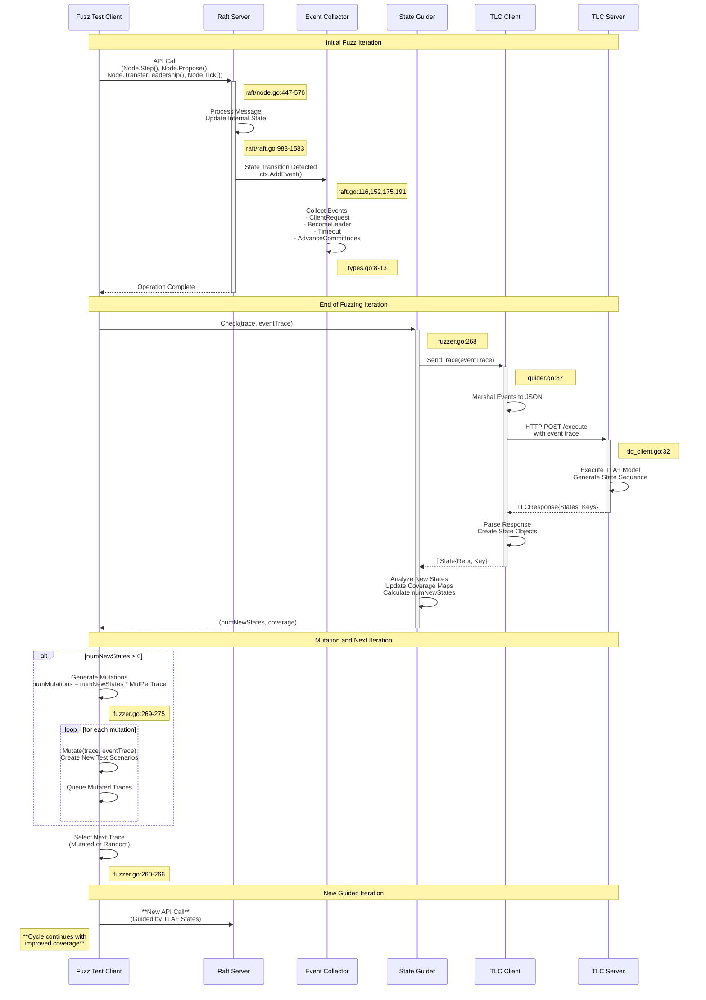

# TLA+ State Transfer Analysis: Raft API Call Integration

## Overview

This document analyzes how API calls to the raft server trigger TLA+ state transfers in the etcd-fuzzing codebase. The system uses TLA+ model checking to verify that the raft implementation matches the formal specification by sending event traces to a TLA+ server for validation.

## Architecture Overview

The codebase implements a fuzzing framework that:
1. Executes raft operations through various API calls
2. Captures events during raft state transitions
3. Sends event traces to a TLA+ model checker for validation
4. Uses the results to guide further fuzzing iterations

## Key Components

### 1. Event Generation Layer
- **Purpose**: Captures raft state transitions as events
- **Location**: `raft.go`, `fuzzer.go`
- **Events**: ClientRequest, BecomeLeader, Timeout, AdvanceCommitIndex, etc.

### 2. TLA+ Integration Layer
- **Purpose**: Manages communication with TLA+ model checker
- **Location**: `guider.go`, `tlc_client.go`
- **Function**: Sends traces and processes TLA+ responses

### 3. Raft API Layer
- **Purpose**: Standard raft node operations
- **Location**: `raft/node.go`, `raft/raft.go`
- **APIs**: Step, Propose, TransferLeadership, Tick, etc.

## Detailed Analysis

### Primary API Entry Points

#### 1. Node.Step() - Message Processing
**File**: `raft/node.go`  
**Lines**: 447-454
```go
func (n *node) Step(ctx context.Context, m pb.Message) error {
    // Ignore unexpected local messages receiving over network.
    if IsLocalMsg(m.Type) && !IsLocalMsgTarget(m.From) {
        return nil
    }
    return n.step(ctx, m)
}
```
**Triggers**: Various state transitions depending on message type

#### 2. Node.Propose() - Client Proposals
**File**: `raft/node.go`  
**Lines**: 443-445
```go
func (n *node) Propose(ctx context.Context, data []byte) error {
    return n.stepWait(ctx, pb.Message{Type: pb.MsgProp, Entries: []pb.Entry{{Data: data}}})
}
```
**Triggers**: ClientRequest events

#### 3. Node.TransferLeadership() - Leadership Changes
**File**: `raft/node.go`  
**Lines**: 569-576
```go
func (n *node) TransferLeadership(ctx context.Context, lead, transferee uint64) {
    select {
    case n.recvc <- pb.Message{Type: pb.MsgTransferLeader, From: transferee, To: lead}:
    case <-n.done:
    case <-ctx.Done():
    }
}
```
**Triggers**: BecomeLeader events

#### 4. Node.Tick() - Timer-Driven Operations
**File**: `raft/node.go`  
**Lines**: 432-439
```go
func (n *node) Tick() {
    select {
    case n.tickc <- struct{}{}:
    case <-n.done:
    default:
        n.rn.raft.logger.Warningf("%x A tick missed to fire. Node blocks too long!", n.rn.raft.id)
    }
}
```
**Triggers**: Timeout events for elections

### Event Generation Points

#### 1. Client Request Handling
**File**: `raft.go`  
**Lines**: 116-123
```go
ctx.AddEvent(&Event{
    Name: "ClientRequest",
    Node: leader,
    Params: map[string]interface{}{
        "request": request,
        "leader":  leader,
    },
})
```
**Triggered by**: Client proposals via `Node.Propose()`

#### 2. Leader State Transitions
**File**: `raft.go`  
**Lines**: 175-189
```go
if old != new && new == raft.StateLeader {
    ctx.AddEvent(&Event{
        Name: "BecomeLeader",
        Node: id,
        Params: map[string]interface{}{
            "node": id,
        },
    })
    ctx.AddEvent(&Event{
        Name: "ClientRequest",
        Node: id,
        Params: map[string]interface{}{
            "request": 0,
            "leader":  id,
        },
    })
}
```
**Triggered by**: Leadership changes via `Node.TransferLeadership()` or elections

#### 3. Election Timeouts
**File**: `raft.go`  
**Lines**: 191-198
```go
} else if (old != new && new == raft.StateCandidate) || (oldTerm < newTerm && old == new && new == raft.StateCandidate) {
    ctx.AddEvent(&Event{
        Name: "Timeout",
        Node: id,
        Params: map[string]interface{}{
            "node": id,
        },
    })
}
```
**Triggered by**: Timer ticks via `Node.Tick()`

#### 4. Commit Index Advancement
**File**: `raft.go`  
**Lines**: 152-159
```go
if len(ready.CommittedEntries) > 0 {
    ctx.AddEvent(&Event{
        Name: "AdvanceCommitIndex",
        Node: id,
        Params: map[string]interface{}{
            "i": int(id),
        },
    })
}
```
**Triggered by**: Log replication via `Node.Step()`

### TLA+ State Transfer Mechanism

#### 1. Fuzzer Main Loop
**File**: `fuzzer.go`  
**Line**: 268
```go
if numNewStates, _ := f.config.Guider.Check(trace, eventTrace); numNewStates > 0 {
    numMutations := numNewStates * f.config.MutPerTrace
    for j := 0; j < numMutations; j++ {
        new, ok := f.config.Mutator.Mutate(trace, eventTrace)
        if ok {
            f.mutatedTracesQueue.Push(copyTrace(new, defaultCopyFilter()))
        }
    }
}
```
**Purpose**: Triggers TLA+ state checking after each fuzzing iteration

#### 2. TLA+ State Guider
**File**: `guider.go`  
**Lines**: 76-107
```go
func (t *TLCStateGuider) Check(trace *List[*SchedulingChoice], eventTrace *List[*Event]) (int, float64) {
    // ... hash calculation ...
    
    curStates := len(t.statesMap)
    numNewStates := 0
    if tlcStates, err := t.tlcClient.SendTrace(eventTrace); err == nil {
        t.recordTrace(trace, eventTrace, tlcStates)
        for _, s := range tlcStates {
            _, ok := t.statesMap[s.Key]
            if !ok {
                numNewStates += 1
                t.statesMap[s.Key] = true
            }
        }
        // ... state trace hashing ...
    } else {
        panic(fmt.Sprintf("error connecting to tlc: %s", err))
    }
    return numNewStates, float64(numNewStates) / float64(max(curStates, 1))
}
```
**Purpose**: Manages TLA+ communication and state tracking

#### 3. TLC Client Communication
**File**: `tlc_client.go`  
**Lines**: 26-50
```go
func (c *TLCClient) SendTrace(trace *List[*Event]) ([]State, error) {
    trace.Append(&Event{Reset: true})
    data, err := json.Marshal(trace)
    if err != nil {
        return []State{}, fmt.Errorf("error marshalling json: %s", err)
    }
    res, err := http.Post("http://"+c.ClientAddr+"/execute", "application/json", bytes.NewBuffer(data))
    if err != nil {
        return []State{}, fmt.Errorf("error sending trace to tlc: %s", err)
    }
    // ... response processing ...
    return result, nil
}
```
**Purpose**: HTTP communication with TLA+ model checker server

## Event Flow Diagram

### High-Level Flow
```
API Call (Node.Step/Propose/TransferLeadership/Tick)
    ↓
Raft State Change (StateLeader/StateCandidate/Log Updates)
    ↓
Event Generation (AddEvent in raft.go)
    ↓
Event Collection (eventTrace accumulation)
    ↓
Fuzzer Iteration Complete (fuzzer.go:268)
    ↓
Guider.Check() (guider.go:87)
    ↓
TLCClient.SendTrace() (tlc_client.go:32)
    ↓
HTTP POST to TLA+ Server (/execute endpoint)
    ↓
TLA+ State Validation & Response
    ↓
New State Discovery & Coverage Tracking
```

### Detailed Sequence Diagram



### Diagram Key Points

1. **API Entry**: Fuzz test client makes API calls to raft server through standard raft node interface
2. **State Transitions**: Raft server processes operations and transitions between states (Leader/Candidate/Follower)
3. **Event Capture**: State transitions automatically trigger event collection via `ctx.AddEvent()`
4. **TLA+ Integration**: Event traces are sent to TLA+ model checker for formal verification
5. **Coverage Feedback**: TLA+ results guide mutation and next iteration selection
6. **Continuous Loop**: The process creates a feedback loop where formal verification guides empirical testing

## Supported Event Types

| Event Name | Trigger Source | File Location | Line Numbers |
|------------|----------------|---------------|--------------|
| ClientRequest | Client proposals, Leadership changes | raft.go | 116-123, 182-189 |
| BecomeLeader | Leadership transitions | raft.go | 175-181 |
| Timeout | Election timeouts | raft.go | 191-198 |
| AdvanceCommitIndex | Log commits | raft.go | 152-159 |
| DeliverMessage | Message delivery | fuzzer.go | 207-224 |
| SendMessage | Message sending | fuzzer.go | 226-243 |

## Configuration

The TLA+ integration is configured in `main.go`:

**Lines**: 96-97
```go
c.Add("tlcstate", combinedMutator, NewTLCStateGuider("127.0.0.1:2023", "traces", recordTraces))
c.Add("random", &EmptyMutator{}, NewTLCStateGuider("127.0.0.1:2023", "traces", recordTraces))
```

- **TLA+ Server**: `127.0.0.1:2023`
- **Trace Recording**: Enabled with path `"traces"`
- **Endpoint**: `/execute` (HTTP POST)

## Key Data Structures

### Event Structure
**File**: `types.go`  
**Lines**: 8-13
```go
type Event struct {
    Name   string
    Node   uint64 `json:"-"`
    Params map[string]interface{}
    Reset  bool
}
```

### TLA+ Response Structure
**File**: `tlc_client.go`  
**Lines**: 11-14
```go
type TLCResponse struct {
    States []string
    Keys   []int64
}
```

## Conclusion

The etcd-fuzzing framework creates a bridge between raft implementation testing and formal TLA+ verification by:

1. **Capturing Events**: Converting raft API calls into structured events
2. **Trace Management**: Collecting event sequences during fuzzing iterations  
3. **TLA+ Communication**: Sending traces to TLA+ model checker via HTTP
4. **State Tracking**: Using TLA+ responses to guide further testing

This integration allows the system to verify that the raft implementation behavior matches the formal TLA+ specification, providing high confidence in the correctness of the distributed consensus algorithm.

